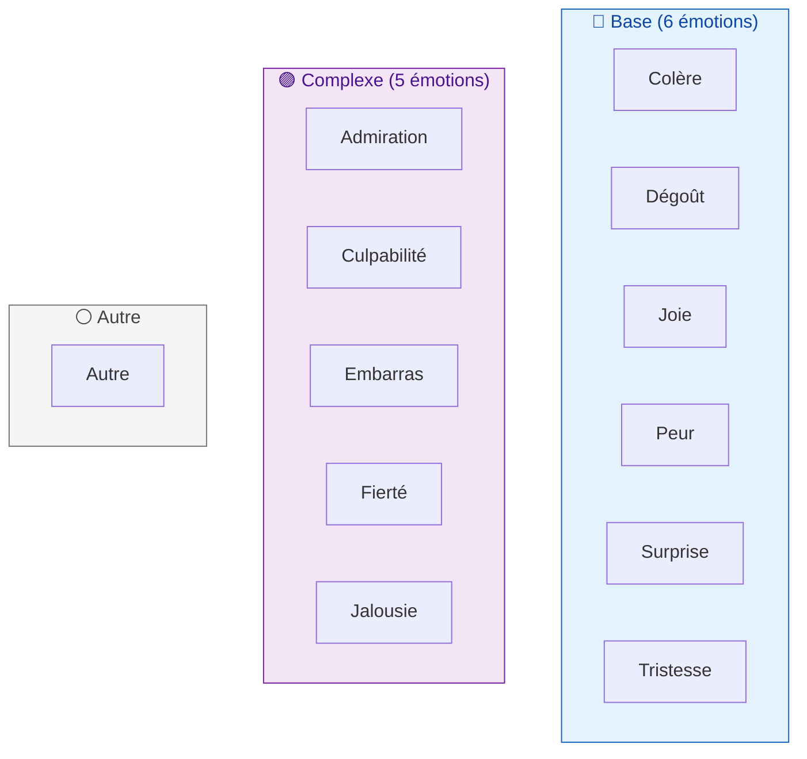
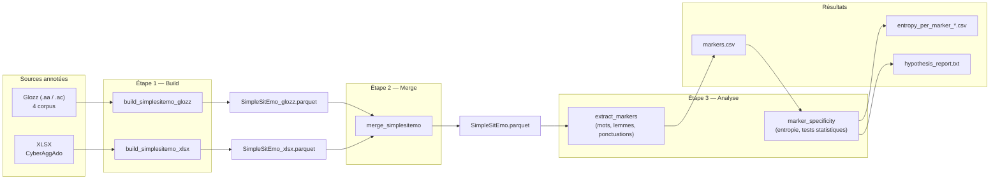

# Expression Émotionnelle

Pipeline d'analyse computationnelle des **marqueurs linguistiques de l'émotion** dans des textes français. Le projet unifie cinq corpus annotés selon le schéma d'Etienne, ([2023](https://bdr.parisnanterre.fr/theses/internet/2023/2023PA100047/2023PA100047.pdf)) dans un format tabulaire inspiré de ses travaux . L'objectif est d'extraire les marqueurs lexicaux ayant un haut niveau de spécificité.


## Table des matières

- [1. Contexte scientifique](#1-contexte-scientifique)
  - [1.1 Corpus utilisés](#11-corpus-utilisés)
  - [1.2 Approche analytique](#12-approche-analytique)
- [2. Taxonomie émotionnelle](#2-taxonomie-émotionnelle)
  - [2.1 Les catégories émotionnelles](#21-les-catégories-émotionnelles)
  - [2.2 Les modes d'expression](#22-les-modes-dexpression)
  - [2.3 Les trois types](#23-les-trois-types)
- [3. Architecture du pipeline](#3-architecture-du-pipeline)
  - [3.1 Flux de données](#31-flux-de-données)
  - [3.2 Le schéma SimpleSitEmo](#32-le-schéma-simplesitemo)
- [4. Installation](#4-installation)
  - [4.1 Prérequis](#41-prérequis)
  - [4.2 Installation rapide](#42-installation-rapide)
- [5. Guide d'utilisation](#5-guide-dutilisation)
  - [5.1 Lancer l'analyse complète](#51-lancer-lanalyse-complète)
  - [5.2 Options disponibles](#52-options-disponibles)
  - [5.3 Fichiers produits](#53-fichiers-produits)
- [Références](#références)


# 1. Contexte scientifique

Le schéma d'annotation utilisé est celui proposé par Etienne et Battistelli ([2021](https://hal.science/hal-03263194v1/document)) et développé dans Etienne ([2023](https://bdr.parisnanterre.fr/theses/internet/2023/2023PA100047/2023PA100047.pdf)). Il modélise l'expression émotionnelle dans les textes à travers la notion de « Situation Émotionnelle » (*SitEmo*).

## 1.1 Corpus utilisés

Le pipeline agrège cinq sous-corpus, issus de deux formats d'annotation distincts :

**Corpus Glozz** (format `.aa` / `.ac`) :

| Corpus | Description |
|:---|:---|
| **Albert** | Articles de presse du magazine *Albert* (presse jeunesse) |
| **CorpusCovid** | Textes relatifs à la pandémie de COVID-19 |
| **LittératureJeunesse** | Extraits de littérature pour la jeunesse |
| **PtitLibé** | Articles du *P'tit Libé* (presse jeunesse) |

**Corpus XLSX** :

| Corpus | Description |
|:---|:---|
| **CyberAggAdo** | Messages de cyberharcèlement en français rédigés par des jeunes de 11 à 18 ans |

## 1.2 Approche analytique

L'analyse repose sur l'extraction de **marqueurs linguistiques** (mots, lemmes, ponctuations) à partir des spans émotionnels annotés, puis sur la mesure de leur **spécificité** vis-à-vis des catégories émotionnelles et des modes d'expression.

La spécificité d'un marqueur est quantifiée par l'**entropie de Shannon** *H*(Émotion | Marqueur) : un marqueur à faible entropie est spécifique à une émotion donnée, tandis qu'un marqueur à forte entropie est utilisé de manière dispersée à travers plusieurs émotions.

Les tests statistiques suivants sont utilisés pour comparer la distribution de l'entropie entre les modes :

- **Test de Kruskal-Wallis** : test global de différences entre les 4 modes.
- **Test de Mann-Whitney U** : comparaisons par paires entre modes, avec calcul de la taille d'effet (corrélation rang-bisériale).

---

# 2. Taxonomie émotionnelle

## 2.1 Les catégories émotionnelles

Le schéma distingue 12 catégories émotionnelles, chacune regroupant des émotions fines. Dans les exemples ci-dessous, les *spans annotés* — c'est-à-dire les segments textuels porteurs de l'émotion — sont indiqués en italique.

| Catégorie | Émotions fines associées |
|:---|:---|
| **Colère** | agacement, colère, contestation, désapprobation, énervement, fureur/rage, indignation, irritation, mécontentement, révolte… |
| **Dégoût** | dégoût, lassitude, répulsion |
| **Joie** | amusement, enthousiasme, exaltation, joie, plaisir |
| **Peur** | angoisse, appréhension, effroi, horreur, inquiétude, méfiance, peur, stress |
| **Surprise** | étonnement, stupeur, surprise |
| **Tristesse** | blues, chagrin, déception, désespoir, peine, souffrance, tristesse |
| **Admiration** | admiration |
| **Culpabilité** | culpabilité |
| **Embarras** | embarras, gêne, honte, humiliation |
| **Fierté** | fierté, orgueil |
| **Jalousie** | jalousie |
| **Autre** | amour, courage, curiosité, désir, espoir, haine, mépris, soulagement… |

## 2.2 Les modes d'expression

Le mode qualifie la *relation* entre le segment textuel (span) et l'émotion qu'il exprime. Il repose sur la typologie de Micheli (2014), adaptée par Etienne ([2023](https://bdr.parisnanterre.fr/theses/internet/2023/2023PA100047/2023PA100047.pdf)). Les *spans* — portions de texte effectivement annotées — sont indiqués en italique dans les exemples.

| Mode | Définition | Exemple (le *span* est en italique) |
|:---|:---|:---|
| **Désigné** | L'émotion est nommée explicitement par un terme du lexique émotionnel. | « Paul est *heureux*. » → Joie |
| **Comportemental** | L'émotion est inférée à partir de la description d'une manifestation physique ou comportementale. | « Elle *éclata en sanglots*. » → Tristesse |
| **Suggéré** | L'émotion est inférée par le lecteur à partir d'une situation décrite, conventionnellement associée à un ressenti. | « Paul *a gagné la course*. » → Joie/Fierté |
| **Montré** | L'émotion transparaît à travers les caractéristiques formelles de l'énoncé (interjections, ponctuation expressive, syntaxe fragmentée, etc.). | « *DEHORSSSSS* » → Colère |

Une unité SitEmo ne peut recevoir qu'un seul mode.

## 2.3 Les trois types

Les 12 catégories émotionnelles sont regroupées en trois types :



- **Base** : les six émotions fondamentales (Colère, Dégoût, Joie, Peur, Surprise, Tristesse).
- **Complexe** : cinq émotions dites « complexes » ou « secondaires » (Admiration, Culpabilité, Embarras, Fierté, Jalousie).
- **Autre** : catégorie résiduelle regroupant les émotions ne relevant ni du type Base ni du type Complexe (amour, mépris, haine, soulagement, etc.).

---

# 3. Architecture du pipeline

## 3.1 Flux de données

Le pipeline suit trois étapes séquentielles, précédées de deux extractions indépendantes :



**Étape 1 — Build.** Deux extracteurs indépendants convertissent les annotations brutes (Glozz XML et XLSX) dans le schéma SimpleSitEmo. Les émotions et modes sont normalisés vers des formes canoniques accentuées (ex. `Colere` → `Colère`, `Designee` → `Désignée`).

**Étape 2 — Merge.** Les deux fichiers Parquet intermédiaires sont validés (colonnes, valeurs canoniques, absence de collision entre sources) puis concaténés en un fichier unifié `SimpleSitEmo.parquet`.

**Étape 3 — Analyse.** L'analyse se décompose en deux sous-étapes :
- **Extraction des marqueurs** : pour chaque span, les mots, lemmes (via SpaCy ou Stanza) et ponctuations sont extraits et associés à chaque émotion annotée sur ce span.
- **Spécificité** : l'entropie de Shannon est calculée pour chaque marqueur, puis agrégée par mode d'expression. Les tests de Kruskal-Wallis et de Mann-Whitney comparent les distributions d'entropie entre modes.

## 3.2 Le schéma SimpleSitEmo

Le format intermédiaire `SimpleSitEmo` est un fichier Parquet à 7 colonnes, unifiant les annotations des deux sources :

| Colonne | Type | Description |
|:---|:---|:---|
| `source_file` | string | Identifiant du corpus d'origine (ex. `"CyberAggAdo"`, `"Albert"`) |
| `text_span` | string | Segment textuel annoté porteur de l'émotion |
| `mode` | string | Mode d'expression (`Comportementale` \| `Désignée` \| `Montrée` \| `Suggérée`) |
| `emotion1` | string | Émotion primaire (label canonique accentué) |
| `emotion2` | string \| null | Émotion secondaire (le cas échéant) |
| `emotion3` | string \| null | Émotion tertiaire (le cas échéant, max 3 par unité) |
| `nature_linguistique` | string \| null | Nature syntaxique du segment (SN, SAdj, Proposition, etc.) |


# 4. Installation

## 4.1 Prérequis

- **Python 3.10+**
- **pip**
- (Optionnel) GPU CUDA pour le backend de lemmatisation Stanza

## 4.2 Installation rapide

```bash
git clone <url-du-dépôt>
cd ExpressionEmotionnelle
bash setup.sh
```

Le script `setup.sh` installe les dépendances Python et télécharge le modèle SpaCy pour le français :

```bash
pip install -r requirements.txt
python -m spacy download fr_core_news_sm
```

**Dépendances** (`requirements.txt`) :

| Paquet | Version minimale |
|:---|:---|
| pandas | ≥ 2.0 |
| numpy | ≥ 1.24 |
| scipy | ≥ 1.10 |
| pyarrow | ≥ 14.0 |
| openpyxl | ≥ 3.1 |
| spacy | ≥ 3.7 |
| torch | — |

---

# 5. Guide d'utilisation

## 5.1 Lancer l'analyse complète

```bash
python -m simplesitemo_pipeline.run_analysis --step all
```

Cette commande exécute les deux sous-étapes de l'analyse (extraction de marqueurs puis calcul de spécificité) sur le fichier `SimpleSitEmo.parquet`.

Pour exécuter les étapes individuellement :

```bash
# Extraction des marqueurs uniquement
python -m simplesitemo_pipeline.run_analysis --step markers

# Calcul de spécificité uniquement (requiert markers.csv)
python -m simplesitemo_pipeline.run_analysis --step specificity
```

## 5.2 Options disponibles

| Option | Description | Valeur par défaut |
|:---|:---|:---|
| `--step` | Étape à exécuter : `markers`, `specificity` ou `all` | `all` |
| `--no-lemma` | Désactive la lemmatisation | `False` |
| `--lemmatizer` | Backend de lemmatisation : `spacy` ou `stanza` | `spacy` |
| `--batch-size` | Taille des lots pour la lemmatisation | — |
| `--remove-stopwords` | Filtre les mots vides français | `False` |
| `--min-freq` | Fréquence minimale d'un marqueur pour le calcul de spécificité | `3` |

**Exemple** — analyse sans lemmes, en filtrant les mots vides, avec une fréquence minimale de 5 :

```bash
python -m simplesitemo_pipeline.run_analysis --step all --no-lemma --remove-stopwords --min-freq 5
```

## 5.3 Fichiers produits

Les résultats sont écrits dans `results/simplesitemo/` :

```
results/simplesitemo/
├── markers.csv                          # Tous les marqueurs extraits
└── specificity_results/
    ├── entropy_per_marker_emotion.csv   # Entropie H(Émotion|Marqueur) par marqueur
    ├── entropy_per_marker_mode.csv      # Entropie H(Mode|Marqueur) par marqueur
    ├── entropy_by_mode_summary.csv      # Entropie moyenne agrégée par mode
    └── hypothesis_report.txt            # Rapport des tests statistiques
```

---

# Références

- Etienne, C. (2023). *Modélisation de l'expression des émotions dans les textes destinés aux enfants et aux adolescents*. Thèse de doctorat, Université Paris Nanterre. [PDF](https://bdr.parisnanterre.fr/theses/internet/2023/2023PA100047/2023PA100047.pdf)
- Etienne, C. & Battistelli, D. (2021). *Un schéma d'annotation pour l'expression des émotions dans les textes*. [HAL](https://hal.science/hal-03263194v1/document)